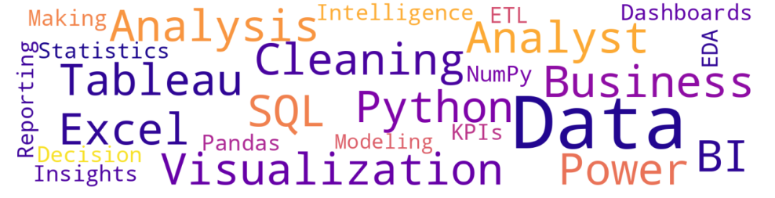

# 🌟 Portfolio Banner

---

# 👋 Hi, I'm Sarthak Raj

**Frontend Web Developer | Data Analyst**

# 💫 About Me:
🔭 I’m currently working as **Data Analyst**. 👯 I’m looking to collaborate on Data Analyst Project. 🌱 I’m currently learning and growing my skills in the feild of Information Technology & Data Analyst. 💬 Ask me about ⚡ Fun fact

## 🌐 Socials:
    

# 💻 Tech Stack:
           

# 📊 GitHub Stats:
 
 

---

## 🎓 Education  

- **Bachelor of Technology (B.Tech)** - *Information Technology*  
  📍 *JIS College of Engineering, Kalyani*  
  📆 *September, 2021 - May,2025*  

- **Advanced Data Analyst Certification** with *IIT Guwahati Certification - Besant Technologies, Bangalore*  
  📊 Focus: Power BI, Excel, SQL, Python, AWS

---

## 🚀 What I Do  
- Craft responsive, user-friendly web interfaces using **HTML**, **Tailwind CSS**, and **JavaScript**  
- Build dynamic, data-driven applications with **Python** and **SQL**  
- Analyze and visualize insights using **Power BI** and **Excel**
- Learning cloud technologies like **AWS** and **Google Cloud** to store large amount of data using CI/CD pipelines to create instances like AWS S3, AWS lambda, etc.
- Blend creativity, data, and logic to deliver impactful digital experiences.
  
---

## 💬 “Design. Analyze. Repeat.”  

✨ Thanks for visiting my profile — feel free to check out my repositories and connect with me!

